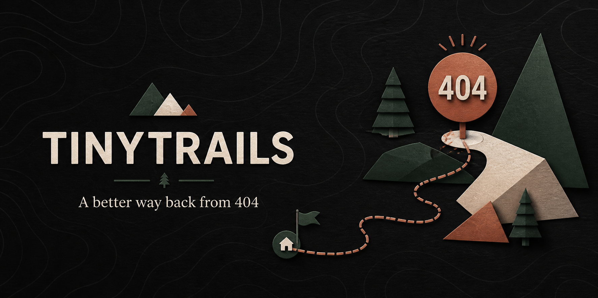
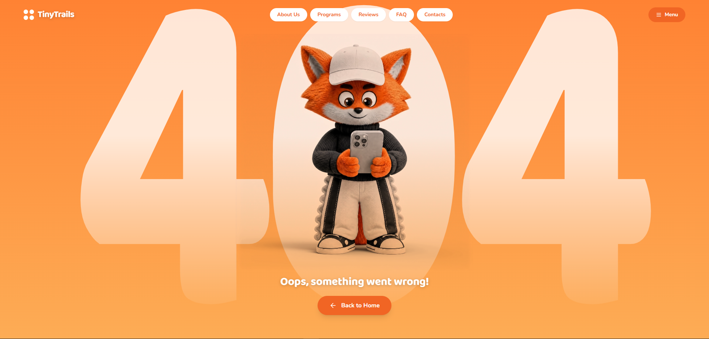

<div align="center">



# TinyTrails 404 Experience

**Playful, interactive, and responsive 404 error recovery page concept.**

[**View Live Demo: errorpage4o4.netlify.app →**](https://errorpage4o4.netlify.app)

[](https://errorpage4o4.netlify.app)
[](https://react.dev/)
[](https://www.typescriptlang.org/)
[](https://vitejs.dev/)
[](https://tailwindcss.com/)
[](https://github.com/amandeavor/Error-page/actions/workflows/ci.yml)

<p align="center">
  <a href="#overview">Overview</a> •
  <a href="#visual-preview">Preview</a> •
  <a href="#interaction-design">Interactions</a> •
  <a href="#quickstart">Quickstart</a> •
  <a href="#guidelines">Guidelines</a>
</p>

</div>

---

## Overview

`TinyTrails 404` is an interactive error recovery screen designed to turn a missing page into an engaging user experience. Built with **React**, **TypeScript**, **Vite**, and **Tailwind CSS**, it combines animated camping illustration aesthetics with quick navigation recovery options.

---

## Visual Preview

<div align="center">
  
</div>

---

## Interaction Design

| Element | Purpose & Implementation |
| :--- | :--- |
| **Playful Wilderness Illustration** | Warm, nature-inspired visual anchors conveying that the user has "wandered off the trail." |
| **Smart Recovery Actions** | Instant return-home button, recent trail search, and direct contact navigation links. |
| **Micro-Animations** | Hover-state transforms, subtle ambient particle effects, and pulse animations. |
| **Fluid Responsiveness** | Tailored viewport scaling ensuring delightful experiences from mobile phones to ultrawide monitors. |

---

## Quickstart

### Prerequisites
- Node.js `18+` LTS
- npm `9+`

### Setup

```bash
# 1. Clone repository
git clone https://github.com/amandeavor/Error-page.git
cd Error-page

# 2. Install dependencies
npm install

# 3. Launch development server
npm run dev
```

---

## Build & Verification

```bash
# Production Vite build
npm run build

# Preview build locally
npm run preview
```

---

## Community & Guidelines

- [Contributing Guide](CONTRIBUTING.md)
- [Security Policy](SECURITY.md)
- [Code of Conduct](CODE_OF_CONDUCT.md)

---

## License

This repository is an interface design sample. All rights reserved.
